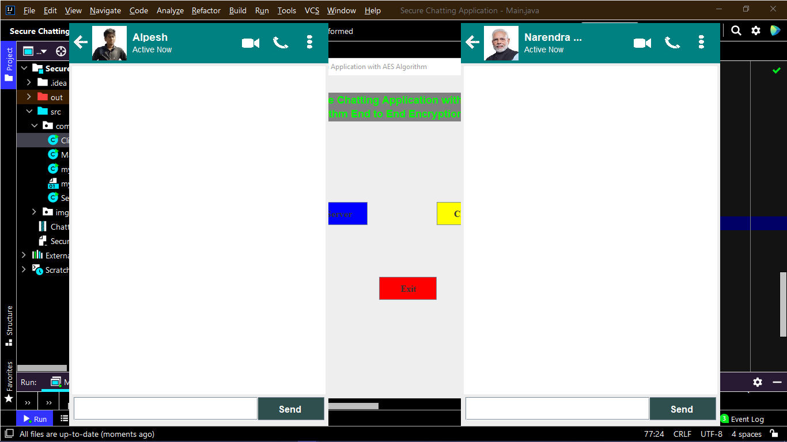
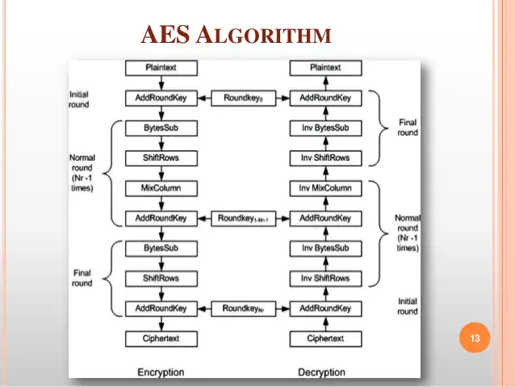

# Secure-Chatting-Application
Secure Chatting Application with AES Algorithm End to End Encryption and Decryption

</img>

</img>

# Advanced Encryption Standard (AES) Algorithm

The AES algorithm (also known as the Rijndael algorithm) is a symmetrical block cipher algorithm that takes plain text in blocks of 128 bits and converts them to ciphertext using keys of 128, 192, and 256 bits. Since the AES algorithm is considered secure, it is in the worldwide standard.

The features of AES are as follows −

- Symmetric key symmetric block cipher
- 128-bit data, 128/192/256-bit keys
- Stronger and faster than Triple-DES
- Provide full specification and design details
- Software implementable in C and Java

## Encryption Process

Here, we restrict to description of a typical round of AES encryption. Each round comprise of four sub-processes. The first round process is depicted below −

</img>

### Byte Substitution (SubBytes)
The 16 input bytes are substituted by looking up a fixed table (S-box) given in design. The result is in a matrix of four rows and four columns.

### Shiftrows
Each of the four rows of the matrix is shifted to the left. Any entries that ‘fall off’ are re-inserted on the right side of row. Shift is carried out as follows −

- First row is not shifted.
- Second row is shifted one (byte) position to the left.
- Third row is shifted two positions to the left.
- Fourth row is shifted three positions to the left.
- The result is a new matrix consisting of the same 16 bytes but shifted with respect to each other.

### MixColumns
Each column of four bytes is now transformed using a special mathematical function. This function takes as input the four bytes of one column and outputs four completely new bytes, which replace the original column. The result is another new matrix consisting of 16 new bytes. It should be noted that this step is not performed in the last round.

### Addroundkey
The 16 bytes of the matrix are now considered as 128 bits and are XORed to the 128 bits of the round key. If this is the last round then the output is the ciphertext. Otherwise, the resulting 128 bits are interpreted as 16 bytes and we begin another similar round.

## Decryption Process
The process of decryption of an AES ciphertext is similar to the encryption process in the reverse order. Each round consists of the four processes conducted in the reverse order −

- Add round key
- Mix columns
- Shift rows
- Byte substitution

Since sub-processes in each round are in reverse manner, unlike for a Feistel Cipher, the encryption and decryption algorithms needs to be separately implemented, although they are very closely related.

</img>

# Communication using java socket - server side and client side

Java Socket programming is used for communication between the applications running on different JRE.
Java Socket programming can be connection-oriented or connection-less.

Socket and ServerSocket classes are used for connection-oriented socket programming and DatagramSocket and DatagramPacket classes are used for connection-less socket programming.

</img>
